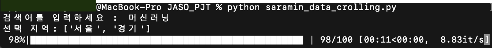
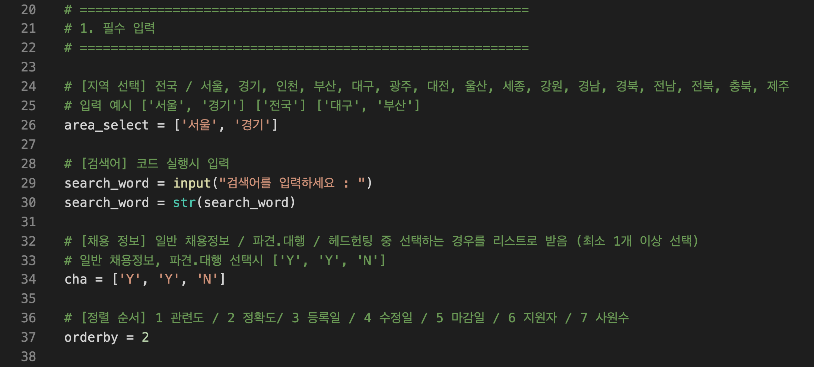
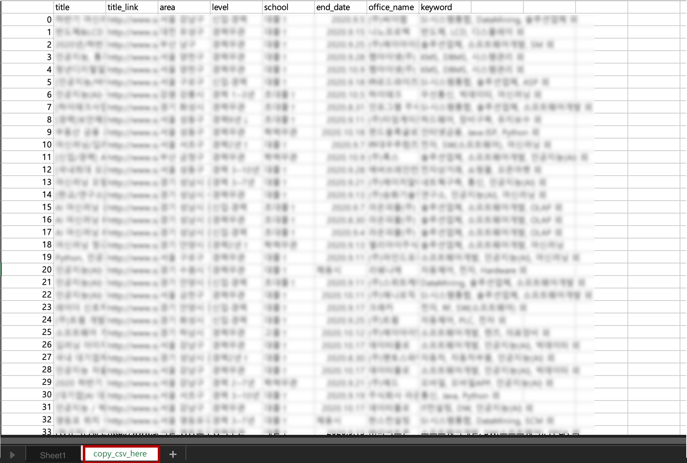
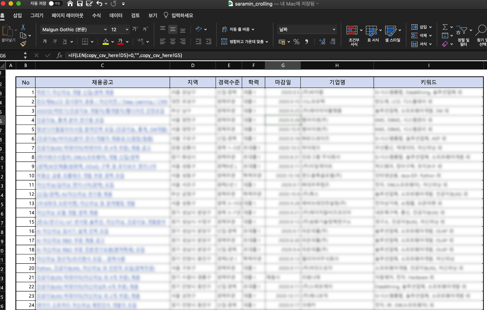

## **recruit_crawler  v1.0** : 채용공고 데이터셋 다운로드하기

```python
'''
(author) Jang HS
(version) 1.0, 초기 버전
(date) 20200830

--- file list ---
- area_path_table.csv : 지역 xpath 정보를 가지고 있는 csv 파일
- saramin_data_crolling.py : 채용공고 크롤러
- saramin_crolling.csv : 크롤링한 채용공고의 샘플 파일
- saramin_crolling.xlsx : 이 파일 내의 copy_csv_here에 saramin_crolling.csv 파일을 붙여 넣으면 sheet1에서 정제된 형태의 공고 파일을 확인 할 수 있음
'''
```


동적 크롤링을 공부해보며 만들어본 코드입니다. 

작년에 취업준비를 하면서 종종 채용공고를 살폈었는데, 채용공고 스크랩의 반복 작업을 편리하게 하는 방법을 고안하던 중 만들어보았습니다. 

​        

py파일을 실행하면 아래와 같이 상위 100개의 게시글을 스크랩합니다.



​    

필요한 패키지는 아래와 같습니다.

- selenium (설치 페이지는 [다음 페이지](https://beomi.github.io/gb-crawling/posts/2017-02-27-HowToMakeWebCrawler-With-Selenium.html)를 참고하였습니다.)
- pandas
- etc - datetime, time, random, csv

​    

필수 파라메터는 다음과 같습니다. 우선 검색어만 코드 실행시 입력받게 하였습니다.



- `search_word` : 검색어를 문자 형태로 받습니다. py코드 실행과 함께 검색어를 입력해야 합니다. (ex) `'AI'`,  `'사무'` 

- `area_select` : 리스트 형태로 지역 입력(최대 15개) : 전국 / 서울, 경기, 인천, 부산, 대구, 광주, 대전, 울산, 세종, 강원, 경남, 경북, 전남, 전북, 충북, 제주 (ex) `['전국']`,`['서울', '경기']`,`['인천', '부산']`...
- `'cha'` : 일반 채용정보 / 파견.대행 / 헤드헌팅 중 선택하는 경우를 리스트로 입력(최소 1개 이상) (ex) 일반 채용정보만 : `['Y','N','N']` 
-  `'orderby'` : 게시글 정렬 순서 > 1 관련도/2 정확도/3 등록일/4 수정일/5 마감일/6 지원자/7 사원수 (ex) 정확도 순으로 정렬할 경우 : `2` 

   

코드가 실행되고 나면 csv형태로 저장이 되고, 이 csv파일을 보기 좋게 정리한 동일한 파일명의 xlsx파일을 함께 남겨두었습니다.  csv 을 전체 카피해서 **xlsx 파일의 copy_csv_here 시트**에 옮겨 붙이면 됩니다.  

    

   

copy_csv_here에 옮겨 붙이면 아래와 같이 **Sheet1**에서 정제된 공고 목록을 볼 수 있습니다.    

채용공고의 하이퍼링크를 누르면 해당 공고 페이지로 이동합니다.   



​    

개인적으로 공부하며 작성한 코드로, 상업용 사용은 불가합니다(채용 공고는 각 기업과 채용공고 사이트(사람인)에 저작권이 있습니다). 감사합니다.